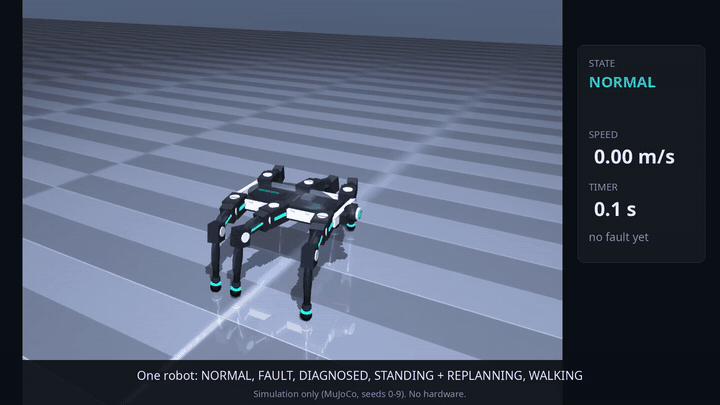
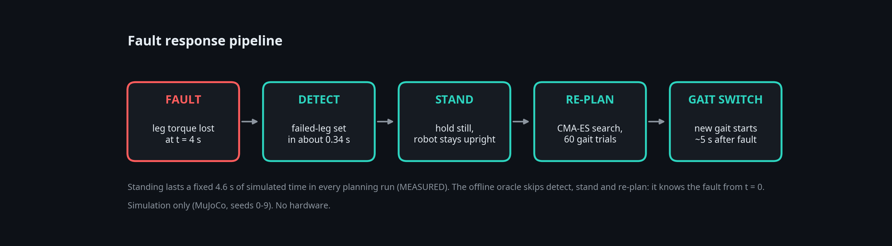
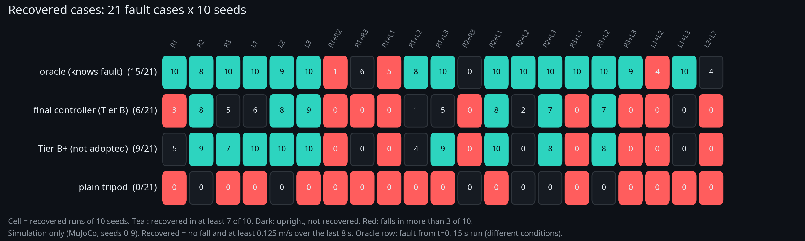
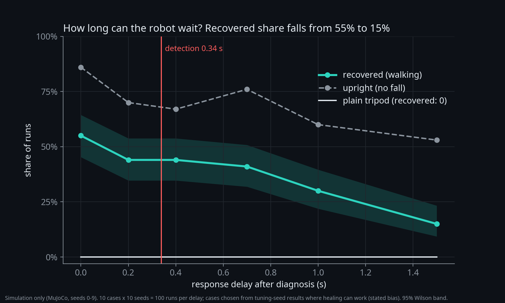

# HexaHeal

How quickly can a simulated six-legged robot react to losing one or two legs? A fault-recovery study in MuJoCo simulation.

## Limits first

- Simulation only, flat ground, disabled-leg faults, 14 s episodes, faults at 4 s. No hardware result. ROS 2, Docker and sim-to-real transfer are UNKNOWN.
- Evaluation seeds 0-9; tuning seeds 100-109. Small samples, with Wilson and paired-bootstrap intervals.
- The oracle knows the fault from t=0 and uses different episode conditions. Its failed searches do not prove physical impossibility.
- Across the controllers with available raw evaluation files, six cases remain below the recovery rule. Missing earlier baseline records prevent an all-controller count. The warm-start experiment did not pass its pre-registered rule.
- The local workspace was lost on October 7. Source and media were recovered, with final Tier B/Tier B+ evaluations re-measured. Some earlier baseline and latency raw files are still missing. See [recovery notes](docs/RECOVERY_20261007.md). No claim of complete historical reproduction is made.

## Question and metric

"Upright" means no fall. "Recovered" also requires at least 0.125 m/s over the last 8 s, half the 0.25 m/s command. A case counts when at least 7 of 10 seeds meet that rule. The earlier no-fall metric could count low-progress runs as success: all 75 upright plain-tripod runs failed the walking-speed threshold (MEASURED), which is not proof of zero motion.



Current embedded media are earlier review assets and contain superseded wording, including the unsupported nine-case failure claim. Corrected launch previews are under owner review; the text here takes precedence over those older overlays.

## Method

The controller detects the failed-leg set, stands while CMA-ES searches a new free gait, then switches. The planner uses a 60-trial budget setting for short simulation trials over phase, duty, amplitude and lift. Its population loop evaluates 61 candidates in a completed search (MEASURED from the implementation). Standing lasts a fixed 4.6 s of simulated time (MEASURED), so the new gait starts about 5 s after the fault.



## Headline

MEASURED, 21 cases, seeds 0-9. Tier B, Tier B+, plain tripod and oracle counts were re-measured during recovery. Other rows below are recovered original MEASURED results, not rerun today.

| controller | recovered /21 | upright /21 |
|---|---:|---:|
| plain tripod | 0 | 6 |
| tuned tripod | 0 | 6 |
| healing v1 | 0 | 4 |
| Tier A offline library | 12 | 13 |
| Tier B online search | 6 | 12 |
| Tier B+ warm start, not adopted | 9 | 14 |
| PPO reference | 1 | 12 |
| offline oracle | 15 | 18 |

Warm start adds 3 cases, with a paired-bootstrap 95% interval [0, +6]. It fails the pre-registered rule: no gain. Tier B minus plain tripod: +6 cases, interval [+4, +8].



## Response delay

The latency plot uses recovered original MEASURED counts, not a fresh sweep. The ten cases were chosen from tuning-seed results where healing can work, a stated bias. Recovery falls from 55% at no added delay to 15% at 1.5 s. Front-leg cases R1/L1 are 0/10 at 0.2 s.



## What did not help

Healing v1: 0 recovered cases. Two later tuning rounds lowered recovered cases on tuning seeds, so the base config stayed frozen. Warm start did not pass its rule. Standing while planning is a possible limit of the measured recovery window (GUESS, untested). Other terrain, speeds and fault models are UNKNOWN.

## Reproduce the recovered v4 results

```sh
pip install -e '.[dev]'
make reproduce-v4
make test
```

`make reproduce-v4` rebuilds v4 statistics and figures from the saved evaluations. `bash scripts/reproduce_v4.sh full` reruns Tier B and Tier B+ on seeds 0-9. MuJoCo 3.15.0 is required for the recorded reproduction check. This does not rebuild missing historical v3 baseline/latency raw files.

[Results v4](docs/RESULTS_V4.md), [original v3 results](docs/RESULTS_V3.md), [plain-language explanation](docs/EXPLAINER.md), [technical note](docs/media_v4/HexaHeal_technical_note.pdf), [posting drafts for owner review](docs/POST.md), [licenses](docs/LICENSES.md).

## Archived experiment

The first experiment tested a fly-connectome-inspired controller. A small MLP beat it, so there was no evidence that wiring mattered. It is in `archive/`. Restricted derived tables are absent from the current tree but remain in older history under the owner's decision. See the license note. Earlier media are superseded, not current results.
