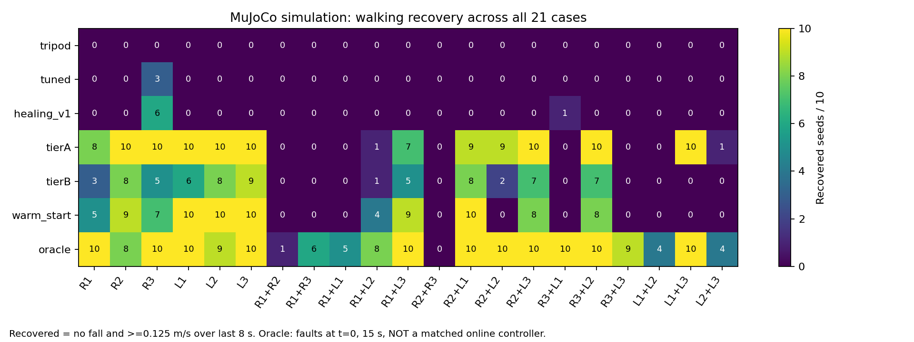
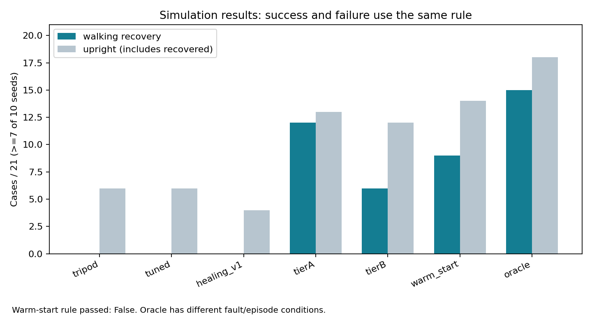

# HexaHeal

A reproducible hexapod fault-recovery study in MuJoCo simulation.

## Limits first

- Simulation only. No hardware result, ROS2 runtime result, or sim-to-real validation.
- Flat ground, one/two torque-disabled legs, 14-second episodes, faults at 4 seconds. Other terrain/fault models are outside this fresh release.
- 10 held-out seeds per case. Tuning seeds 100-109; evaluation seeds 0-9. Frozen settings, no release-time tuning.
- Replanning uses an artificial simulation-time delay, not a measured real-time compute deadline. The nominal 60-trial setting evaluates 61 candidates; standing lasts 4.6 simulated seconds.
- The oracle knows failures at time zero and runs 15 seconds: different initial conditions, not a matched online baseline.
- Warm start failed its pre-registered adoption rule. Upright does not imply walking recovery.
- Historical PPO/latency results and older media are not independently validated by this release. They remain historical documentation, not the current headline.

## Question

Can a robot detect lost leg actuation, search for a gait, and recover walking after the fault?

Recovered means no fall and forward speed >=0.125 m/s over the last 8 seconds, half the 0.25 m/s command. A case counts when >=7/10 evaluation seeds meet that rule. Low speed is not proof of zero motion.

## Fresh results

MEASURED in simulation: 1470 freshly run episodes, all 21 leg-loss cases for seven controllers. Complete raw files back every row below.

| Controller | Recovered /21 | Upright /21 |
|---|---:|---:|
| Plain tripod | 0 | 6 |
| Tuned tripod | 0 | 6 |
| Healing v1 | 0 | 4 |
| Tier A offline library | 12 | 13 |
| Tier B online search | 6 | 12 |
| Warm start, not adopted | 9 | 14 |
| Oracle, different conditions | 15 | 18 |

MEASURED: Tier B minus plain tripod +6 cases, paired seed-cluster bootstrap 95% interval [+4,+8]. Warm start adds +3, interval [0,+6], failing the positive-lower-bound adoption rule. The higher count is not evidence sufficient to adopt it.





[Raw CSV](release/validation/runs.csv), [JSONL](release/validation/runs.jsonl), [summary](release/validation/summary.json), [frozen experiment](release/validation/experiment.json), [hardware](release/validation/hardware.json), [historical exact-field check](release/validation/historical_comparison.json).

[Short simulation demo](release/validation/demo.mp4): first case R1, seed 0, declared before rendering. This episode does not meet the walking-recovery rule; movement in a clip is not our recovery metric. All failures remain in the full dataset.

## One command: setup, run, test, report

```sh
bash scripts/release.sh
```

Linux, Python 3.10, headless EGL for the demo. Exact package versions are in `requirements.lock`. Completed run keys resume rather than silently recomputing. For an independent rerun, move saved `release/validation` aside first. [Reproduction instructions and scope](release/README.md).

The command runs unit/integration simulation tests, evaluations, historical comparisons, a demo, CSV export, plots and checksums. CPU/runtime and configuration are recorded separately. No tuning or cherry-picking is done by this command.

## Architecture

Procedural 18-DOF MJCF robot -> CPG baseline -> joint-health monitoring -> failed-leg diagnosis -> standing hold -> CMA-ES free-gait search -> gait switch. Tier A uses a tuning-derived offline library; Tier B searches in simulated rollouts; warm start excludes the exact failed-leg set and its mirror from that library.

The detector/search use simulated state. Search uses a fresh simplified model, not a state-matched digital twin. Nothing demonstrates a deployable real robot. Waiting is part of this measured experiment.

## What did not help

Plain/tuned tripod and healing v1 fail the walking-recovery case rule. Warm start failed the pre-registered rule despite adding three cases. Two earlier tuning changes lowered tuning-seed recovery and were rejected; see historical `docs/RESULTS_V3.md`. No new latency/dropout experiment is added here. Negative outcomes use the same case denominator and prominence as successes. Hardware, terrain transfer and extra fault models are UNKNOWN.

## Licenses and archived work

Current procedural robot/code: MIT. MuJoCo and dependencies retain their licenses; [copied notices](release/dependency_licenses/index.json), [license boundary](docs/LICENSES.md). Encoded media uses the separately licensed FFmpeg build recorded in the notices.

The archived fly-connectome-inspired experiment showed no evidence that wiring mattered; a small network could reproduce its function. It is outside this release. Restricted FlyWire-derived data absent from the current tree remains in older history under its original terms. MIT does not cover that historical third-party data.
