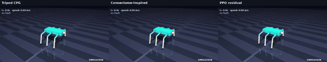

# NeuroWalker



  

A simulated 18-DOF hexapod (MuJoCo) whose walking is modulated by a **connectome-inspired controller**: a 10,000-neuron spiking subgraph of the published FlyWire fruit-fly connectome. It is benchmarked against a PPO residual policy and a classic tripod-gait CPG, and it can detect and recover from leg and joint faults. **Simulation only.**

## The 30-second version
Take a map of how a fruit fly's brain cells connect. Cut out a 10,000-cell piece around the cells that feel the body and the cells that send commands down. Feed the robot's sensor readings into the input cells, read the output cells, and let them nudge the speed and turning of a normal walking pattern. Then break a leg and see whether the robot notices and adapts. It is not a copy of a fly brain, and the robot does not think like a fly.

## Key results (generated from `results/summary.json`; 10 seeds per cell, see docs/BENCHMARK.md)
| scenario | Tripod CPG | Connectome-inspired | PPO residual |
|---|---|---|---|
| flat | 2.63 m, 0/10 falls | 2.76 m, 0/10 falls | 1.44 m, 0/10 falls |
| rough1 | 2.68 m, 0/10 falls | 2.78 m, 0/10 falls | 1.51 m, 0/10 falls |
| rough2 | 2.66 m, 0/10 falls | 2.76 m, 0/10 falls | 1.54 m, 0/10 falls |
| rough3 | 2.62 m, 0/10 falls | 2.73 m, 0/10 falls | 1.55 m, 0/10 falls |
| slope10 | 2.15 m, 0/10 falls | 1.56 m, 3/10 falls | 1.58 m, 0/10 falls |
| slope15 | 0.19 m, 8/10 falls | -0.09 m, 10/10 falls | 1.49 m, 0/10 falls |
| slope20 | -0.12 m, 10/10 falls | -0.08 m, 10/10 falls | 1.22 m, 0/10 falls |
| push | 2.02 m, 5/10 falls | 2.23 m, 5/10 falls | 0.83 m, 10/10 falls |

Speed retained after a fault, plain -> with self-healing:

| fault | Tripod CPG | Connectome-inspired | PPO residual |
|---|---|---|---|
| disable leg | 0% -> 30% | 0% -> 38% | 77% -> 49% |
| lock joint | 0% -> 78% | 71% -> 80% | 79% -> 70% |
| reduce torque | 0% -> 140% | 0% -> 57% | 0% -> 8% |
| sensor dropout | 98% -> 82% | 107% -> 97% | 0% -> 2% |

Full tables, confidence intervals and "where each controller loses": [docs/BENCHMARK.md](docs/BENCHMARK.md). Figures: `docs/figures/`.

Connectome subgraph: 10,000 neurons, 797,577 synapse pairs; 0.095 s compute per simulated second on the build sandbox (2 vCPU). Validation: sugar-sensing neuron drive reaches feeding motor neurons in the full network (`docs/figures/validation_shiu_sugar.png`, qualitative only).

## What this is / what this is not
- Is: a simulation study with a connectome-derived wiring diagram inside a hand-designed input/output mapping.
- Is not: an uploaded or emulated brain, a claim about how flies walk, or hardware. The I/O mapping is a design choice.

## Verification status
| item | status |
|---|---|
| Core sim, controllers, healing, benchmark, tests | run in the build sandbox |
| ROS 2 nodes, Docker image | UNVERIFIED (written, syntax-checked only) |
| GitHub Actions CI, Pages | UNVERIFIED until a run succeeds |
| GTX 1660 Ti runtimes | NOT MEASURED. All timings are from a 2 vCPU CPU sandbox |

## Quickstart
```bash
make setup && make test      # install + fast tests
make demo                    # render a clip
make benchmark report        # arena + figures
python scripts/download_data.py   # FlyWire data download + checksum check (data is never committed)
```
## Citations
Dorkenwald et al. 2024 (FlyWire, Nature); Shiu et al. 2024 (whole-brain LIF model, Nature); Lobato-Rios et al. 2022 and Wang-Chen et al. 2024 (NeuroMechFly); Todorov et al. 2012 (MuJoCo). FlyWire data is CC BY-NC 4.0; Shiu et al. code is MIT. See CITATION.cff and THIRD_PARTY_NOTICES.md.
